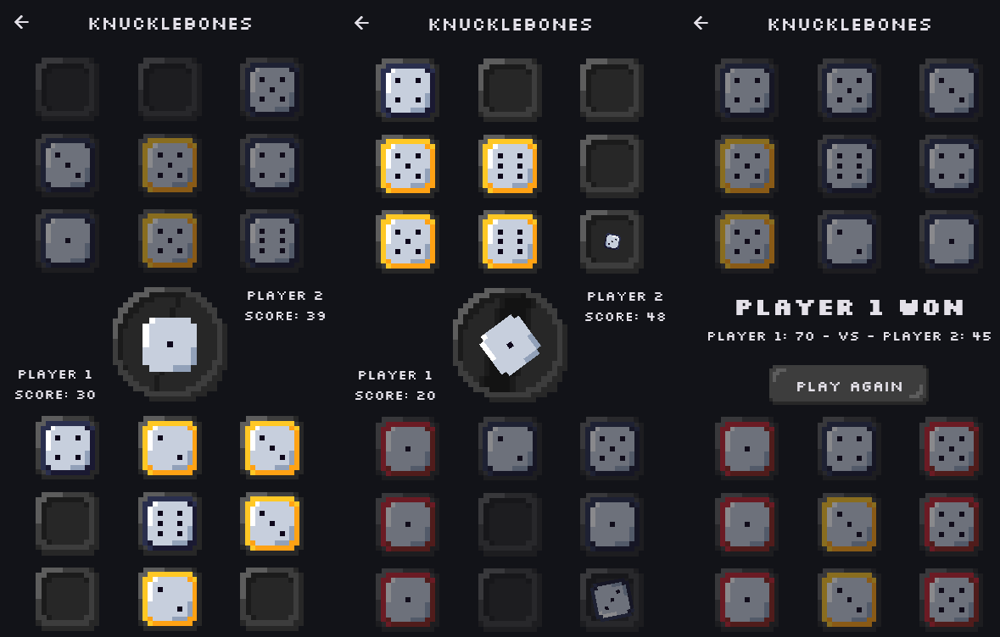

# knucklebones

**Knucklebones is Flutter recreaton of a Cult of the Lamb minigame with the same name.**

The game can be played vs the computer or vs another person on the same screen.

The vault shoots up a dice with a random number. Players take turns placing the dices in one of their three stacks. If a dice with the same number is in the stack of your enemy, the enemy's dice gets removed, but if it's in your stack its value is multiplied by the number of occurrences in the stack. Game ends when no player can make a move and the winner is the person with the highest score.

